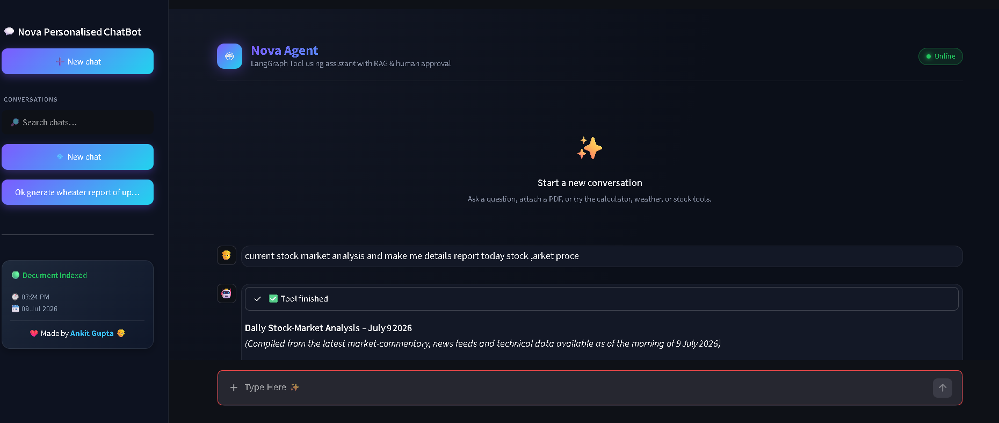

<div align="center">

## 🧠 ***Nova Agent***

### ***AI Personal Assistant powered by LangGraph, RAG & Human-in-the-Loop***
-  ***Nova Agent is an AI-powered personal assistant that can chat with your documents, answer questions using Retrieval-Augmented Generation (RAG), execute real-world tools like Weather, Calculator, and Stock Analysis, maintain persistent conversations, and request human approval for sensitive actions through an intuitive Streamlit interface.***

<p>


</p>

</div>
---

### 🌐 Live Demo
-  **Nova Agent:** **https://novaa-agentic-bot.streamlit.app**
  
---

### 📸 UI Preview

<p align="center">

</p>

---

### Key Features ✨ 

- 🤖 AI Personal Assistant
- 📄 Chat with PDFs using RAG
- 🧠 Persistent Chat Memory
- 💬 Multi-Conversation Support
- 🛠️ Intelligent Tool Calling
- 📈 Live Stock Analysis
- 🌦️ Weather Reports
- 🧮 Calculator Tool
- 👨 Human Approval (HITL)
- ⚡ Fast Responses with Groq LLM

---

### 🏗️ Architecture

```text
                  👤 User
                     │
                     ▼
          🎨 Streamlit Interface
                     │
                     ▼
            🧠 LangGraph Agent
       ┌─────────┼──────────┐
       │         │          │
       ▼         ▼          ▼
   📄 RAG     🛠️ Tools    💾 Memory
       │         │          │
       ▼         ▼          ▼
 ChromaDB   Weather      SQLite
            Stocks
          Calculator
```

---

### 🛠️ Tech Stack

| Category | Technologies |
|-----------|--------------|
| 💻 Language | Python |
| 🎨 Frontend | Streamlit |
| 🧠 AI Framework | LangGraph, LangChain |
| 🤖 LLM | Groq |
| 📄 RAG | ChromaDB, Google Generative AI Embeddings |
| 🗄️ Database | SQLite |
| 📑 PDF Processing | PyPDF |
| 🛠️ Tools | Weather, Calculator, Stock Analysis |

---

### 📂 Project Structure

```text
Nova-Agent/
│
├── src/
│   ├── backend.py
│   ├── rag.py
│   └── tool.py
│
├── app.py
├── requirements.txt
├── config.toml
└── README.md
```

---

### 👨‍💻 Developer
- **👨 Made By Ankit Gupta**

--- 

💡 ***AI Backend Engineer • Agentic AI • LangGraph • LangChain • RAG • LLM Applications***

⭐ **If you found this project helpful, consider giving it a Star**
